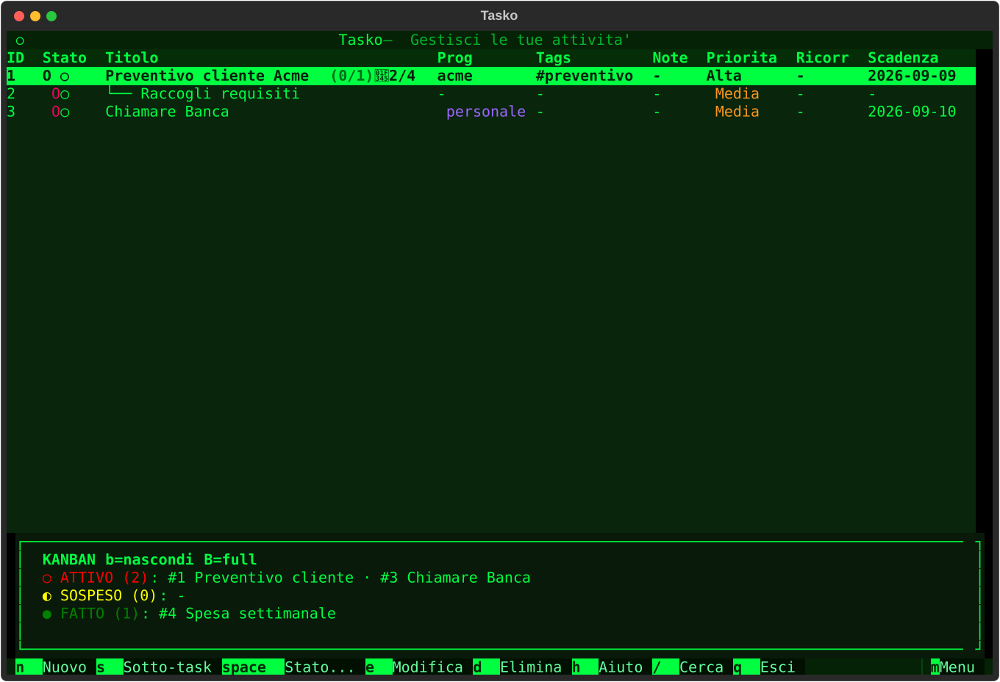
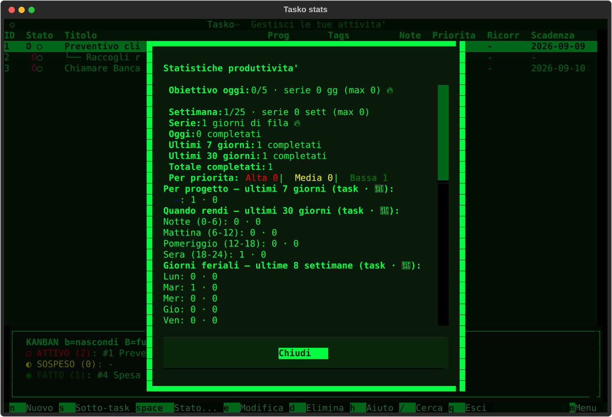

# Tasko

Tasko turns quick notes into a realistic day plan: natural-language capture, a smart morning proposal, pomodoro focus during the day, evening closing. Offline-first, in English or Italian, no account.

```text
Capture in seconds (n, natural language) → morning Briefing + Smart plan (P)
→ work from the Day plan with pomodoro (o) → evening Closing (R).
```

In the app, open the menu (`m`) → `Day` → `Recommended workflow` for the 5-step daily checklist.

[Leggimi in italiano](README.it.md)




## Install in 2 minutes

1. You need Python 3.12+: check with `python3 --version`.
2. Recommended: isolated install with pipx (puts `tasko` on your PATH):
```bash
pipx install .
```
From the git repo:
```bash
pipx install git+https://github.com/fabx-dev/tasko.git
```
3. Alternative for developers (virtualenv):
```bash
python3 -m venv .venv
.venv/bin/pip install .
```
4. Start the TUI:
```bash
tasko
```
On first run: load the demo data to explore, or start empty.

Check it works:
```bash
tasko --help
tasko list
```

Common issues: `pipx: command not found` (install pipx first), old Python (<3.12), separate data dir with `TASKO_HOME=/tmp/tasko-demo tasko`. Docker (`docker compose up`) is dev-only, not the main install path.

Requires Python 3.12+. Built with Textual; data stays in local JSON (see Data below).

## Keys

| Key | Action |
|---|---|
| `n` / `s` | New todo / subtask of selected |
| `Space` then `1/2/3` | Active / Paused / Done |
| `Enter` / `e` | Details (with inline edit) / Edit |
| `d` / `u` | Delete (confirm) / Undo |
| `o` / `O` / `X` | Start-open pomodoro / pause-resume / complete-skip |
| `b` / `B` | Mini-kanban / full board |
| `c` / `w` / `p` / `k` | Calendar / week / daily plan / stats |
| `f` / `t` / `g` / `/` | State, tag, project, search filters |
| `T` / `v` / `m` / `h` | Templates / theme / menu / help |
| `q` | Quit |

Press `m` for the menu (settings, goals, backup, import/export, archive). Press `Tasti` there for the full key list.

## Data

Everything lives in local JSON next to your home (offline-first):

| File | Content |
|---|---|
| `~/.todo_app.json` | Tasks (+ `.bak.json` previous copy) |
| `~/.todo_templates.json` | Templates |
| `~/.todo_pomodoro.json` | Timer session + cycle |
| `~/.todo_config.json` | Theme, filters, goals, language |
| `~/.todo_archive.json` | Archived done tasks |
| `~/Tasko_backups/` | Automatic zip snapshots (14 kept) |
| `~/Tasko_screenshots/` | SVG screenshots, CSV/Markdown exports |

Restore a backup any time from the menu (`Backup: ripristina`). Language follows the system (Italian or English), override with `TASKO_LANG=it|en` or in Settings.

## Dev

```bash
pip install -r requirements-dev.txt
python -m pytest tests/ -q
python -m ruff check src/ tests/
```

See [CONTRIBUTING.md](CONTRIBUTING.md). Hobby project, Italian-first: issues in Italian or English welcome.

## License

MIT — see [LICENSE](LICENSE) and [CHANGELOG.md](CHANGELOG.md).
